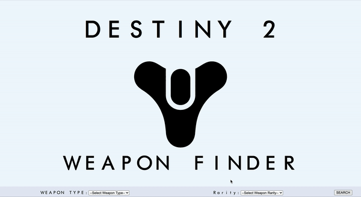

# Destiny_Item_Finder
Web application using Bungie’s API for finding details on specified items. Personal project made in two days time.

## Webpage Demo


## Requirements
- Node 12.0.0
- Sqlite3

## Development
### Installing Dependencies
From within the root directory:
```sh
npm install -g webpack
npm install
```
### Starting Up
Start WebPack for Development
```sh
npm run build:dev
```
Start Express Server With Nodemon on localhost:3003
```sh
npm run start:dev
```

## Production
### Starting Up
Render Bundle
```sh
npm run build
```
Start Express Server
```sh
npm start
```
